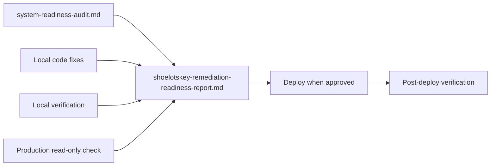

# Shoelotskey Remediation & Readiness Report

## Goal

Produce a durable, version-controlled report file from the completed remediation session content you provided. This document will serve as the official remediation sign-off artifact for defense/evaluation, complementing (not replacing) [`docs/system-readiness-audit.md`](docs/system-readiness-audit.md).

## Output File

Create:

**[`docs/shoelotskey-remediation-readiness-report.md`](docs/shoelotskey-remediation-readiness-report.md)**

Rationale:
- Matches existing documentation convention (`docs/system-readiness-audit.md`, `docs/SECURITY_AUDIT_FIXES_2024.md`)
- Keeps evaluation artifacts together and out of the repo root (avoids cluttering alongside `COMPREHENSIVE_AUDIT_REPORT.md`)
- Filename is explicit and searchable

## Document Structure

The report will use this top-level outline (sections A–X exactly as specified):

1. **Header metadata** — title, date (2026-09-09), baseline reference to `docs/system-readiness-audit.md`, scope note (local remediation complete; no git push/deploy performed)
2. **Executive summary** — 3–5 sentences: local fixes done, production gaps remain, final decision NO — NOT READY
3. **A. P0 Issues Fixed** — markdown table (Issue | Audit Finding | Root Cause | Fix | Verification)
4. **B. P1 Issues Fixed** — markdown table (Issue | Fix Summary | Files | Verification)
5. **C. P2 Issues Fixed** — explicit "None in this pass"
6. **D. Issues Intentionally Deferred** — markdown table with blocker column
7. **E–L. Change Summary** — grouped bullets for files, database, API, frontend, ML, security, SQLite/offline, sync
8. **M–P. Verification Results** — subsections for local testing, network interruption, browser testing, production read-only
9. **Q. Regression Results**
10. **R. Research-Objective Readiness** — table mapping Objectives #1–#6
11. **S. ISO/IEC 25010 Readiness** — characteristic status table
12. **T–U. TAM and Use-Case Readiness**
13. **V. Deployment Readiness** — gate checklist table
14. **W. Remaining Blockers**
15. **X. Remaining Non-Blocking Issues**
16. **Next Steps** — deploy workflow (review diff → commit → push → Heroku → prod verify → ML train)
17. **Final Decision** — exact closing line:

   > **Is the system ready for formal ISO/IEC 25010, TAM, and use-case evaluation?**
   >
   > **NO — NOT READY**

## Formatting Rules

- Convert all pasted tabular content into proper GitHub-flavored markdown tables
- Use relative links for file paths (e.g. `[backend/main.py](backend/main.py)`)
- Use checkmarks (✅/❌/⏳) consistently as in your draft
- Do **not** include credentials, JWTs, DATABASE_URL values, or `.env` contents
- Do **not** modify research objectives, ISO/IEC 25010 statements, or TAM statements
- Cross-reference audit IDs (CRIT-1, HIGH-1, etc.) where they appear in section A/B

## What Will NOT Be Changed

- No application code edits
- No git commit or push
- No changes to [`docs/system-readiness-audit.md`](docs/system-readiness-audit.md) or evaluation methodology files
- No production data modification

## Verification After Creation

- Confirm the file renders cleanly (valid markdown tables, no broken section headers)
- Confirm all 26 subsections (A–X + header + next steps + final decision) are present
- Confirm final decision line matches required exact wording

